# Federated Learning for Small Language Models on iOS  

This repository implements a **Federated Learning (FL) system** for **Small Language Models (SLMs)**, enabling **on-device training and inference** on iOS devices. The system trains models across multiple devices while preserving user privacy by **keeping data local** and only sharing model updates.  

---

## Table of Contents

1. [Project Structure](#project-structure)
2. [Prerequisites](#prerequisites)
3. [Install Virtual Environment](#install-virtual-environment)
4. [Running the Flask server](#running-the-flask-server)
5. [Setting Up the Flutter App](#setting-up-the-flutter-app)
6. [Running Federated Learning](#running-federated-learning)

---

## Project Structure

```
├── federated_slm_app/ 
│ ├── ios/
│ │ ├── Runner/
│ │ │ ├── imdb_updatable_model.mlpackage # The updatable base model for federated learning
│ │ │ ├── AppDelegate.swift # Client logic for handling on-device training/inference
│ │ │ ├── tokenizer.json # Distributed tokenizer for tokenizing text inputs
│ │ ├── Podfile # CocoaPods dependencies 
│ ├── lib/ 
│ │ ├── main.dart # UI for input & model results 
│ ├── pubspec.yaml # Flutter specifications and dependencies
├── server/
│ ├── models/ # Extracted models from clients
│ ├── uploads/ # Uploaded compressed models from clients 
│ ├── app.py # FL server handling distributed training/test data, obtaining metrics, and model aggregation
│ ├── aggregated_model.mlmodel # Global model aggregated from clients 
│ ├── benchmark.py # Visualize metrics 
│ ├── imdb_model.keras # Centralized model for comparison
├── requirements.txt # Server dependencies 

```


---

## Prerequisites

**Please read through this Prerequisites section before you clone this repository**

To setup the project, you will need a macOS machine and an iPhone running on iOS 16.0 or later with an active AppleID. Make sure your iPhone's Developer Mode is enabled by going into `Settings -> Privacy & Security -> Developer Mode -> On`. For the macOS machine, it is recommended that you have a physical machine that runs on macOS operating system for ease of setup. If you only have a Windows machine, then we highly recommend that you use VMWare to host a virtual machine that runs on macOS, just like how we did. Please refer to these YouTube guides to setup a macOS virtual machine on your Windows physical machine:

For Intel: https://youtu.be/Fq6j9CS7C5g?si=lfUbLvTTYuZOxFlc

For AMD: https://youtu.be/gY97OI-bTxE?si=FYskvw_nN0MXH1Qt

Note that if you have a physical macOS machine, then setting up the server and building the iOS app will be done on the same codebase (you just need to clone this project once). Otherwise, if you have a macOS virtual machine, you'll need to clone this project twice. Once on your Windows environment with WSL Ubuntu (and we highly suggest you use WSL Ubuntu if you are going this route) to setup the server, and once on your macOS virtual machine to build the iOS app.

### 1. Install Xcode

We assume that you have your macOS machine up and running. If you have macOS as a virtual machine, then it is likely macOS Sonoma you are using if you followed the YouTube guides. We suggest that you get Xcode 15 as it is compatible with this macOS version. Otherwise, if you have a physical macOS machine, then install the Xcode version that is compatible with the macOS version you are running. Please visit this Apple's Developer website to download Xcode to your macOS machine: https://developer.apple.com/download/all/?q=Xcode

Once you have downloaded Xcode and extracted it as an application file, you will see something like this when Xcode is opened for the first time. Make sure to check the iOS platform for installation:

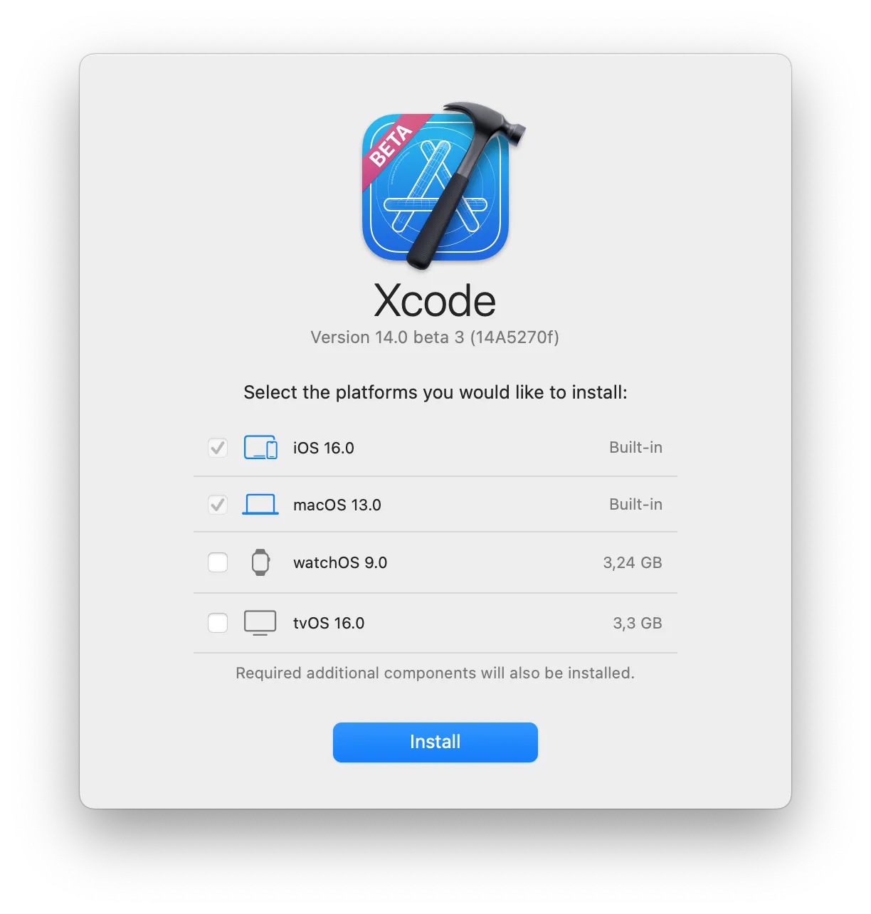

### 2. Install Homebrew, Git, and CocoaPods

Git makes it easy to install and work with Flutter and building the iOS app later on while CocoaPods will make the process of managing dependencies on the Xcode project easier. To install Git and CocoaPods the easy way, we need to install Homebrew first on our macOS machine. 

Follow the instructions from the [Homebrew installation guide](https://brew.sh/) to install Homebrew and add it to PATH on your macOS machine. Once you have successfully installed Homebrew and added it to PATH, you should be able to run this command on your macOS terminal:

```bash
brew --version
```

Next, you will install Git and CocoaPods and add them to PATH via brew command, this can be done as followed:

```bash
brew install git
brew install cocoapods
```

Once you have successfully installed Git and CocoaPods and added them to PATH, you should be able to run these commands:

```bash
git --version
pod --version
```

### 3. Install VSCode

If you have macOS as a virtual machine, then you would need to have VSCode on both the Windows physical machine and the macOS virtual machine. Otherwise, you would only need to install VSCode once if it is a physical macOS machine.
Follow the instructions from the [VSCode installation guide for Windows](https://code.visualstudio.com/docs/setup/windows) and the [VSCode installation guide for macOS](https://code.visualstudio.com/docs/setup/mac) to install VSCode and add it to PATH. 

### 4. Install Flutter

Flutter is needed to build our iOS app. Follow the instructions from the [Flutter installation guide](https://docs.flutter.dev/get-started/install/macos/mobile-ios) to install Flutter and add it to PATH on your macOS machine. 

Once you have Flutter installed and added to PATH, you should be able to run this command on your macOS terminal:

```bash
flutter doctor
```

Make sure the summary should look something like this. All but the Android toolchain and development for the web sections should have a check mark before them. If you see the Xcode section have a cross mark, follow the instructions on the terminal to complete Xcode setup, then run 'flutter doctor' command again.

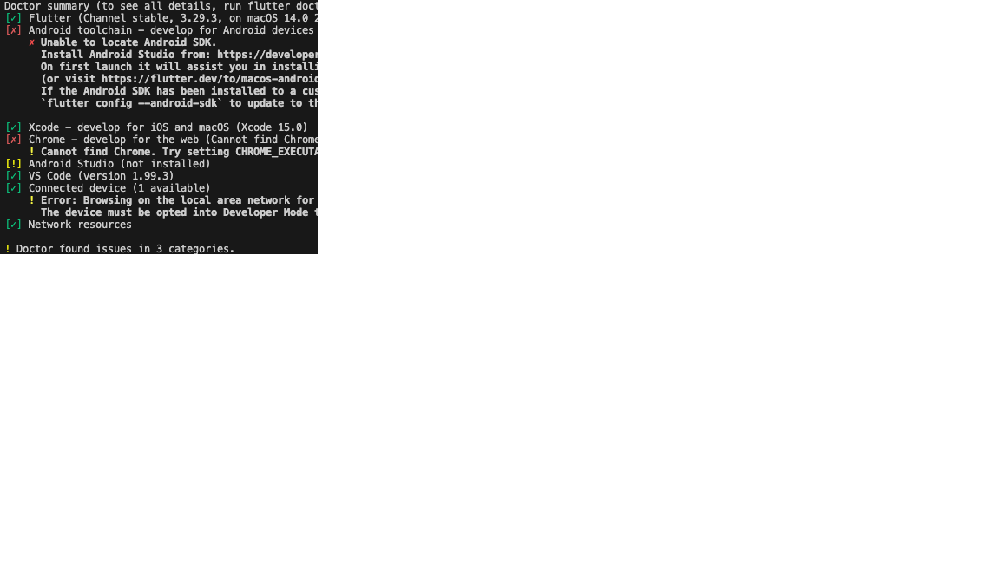


### 5. Install WSL Ubuntu (if you have macOS as a virtual machine)

If you are using a physical Windows machine, we recommend using WSL Ubuntu to setup the server. You can download Ubuntu from the Microsoft Store. 

### 6. Install Python

Python is needed to setup the server side of the project. If you have a physical macOS machine, then you can simply use brew to install Python on it using the following command:

```bash
brew install python
```

Once Python is installed and added to PATH on your physical macOS machine, you should be able to run this command on your macOS terminal:

```bash
python3 --version
pip3 --version
```

If you have macOS as a virtual machine, then you can open up a WSL Ubuntu Terminal and run the following command:

```bash
sudo apt install python3 python3-venv python3-pip
```

Make sure that Python is added to your system's PATH during installation. You can check with this command on your WSL Ubuntu terminal:

```
python3 --version
pip --version
```

## Clone the repository

If you have either a physical or virtual macOS machine, open up a Terminal and clone the repository using this command:

```bash
git clone https://github.com/rubynguyen2505/Federated-SLM-on-iOS.git
```

If you are using a macOS virtual machine, additionally run the same command on a Terminal on your Windows machine.

## Install Virtual Environment

Since our server is a Python Flask-based server, it is recommended to set up a virtual environment for Python dependencies to avoid conflicts with global Python packages. If you have a macOS virtual machine, only open up a Terminal on the WSL Ubuntu environment since that is where we setup the server. If you have a physical macOS machine, then open up a Terminal on it instead. Follow the steps below to set it up:

1. **Navigate** to where you cloned this repository:

   ```bash
   cd Federated-SLM-on-iOS
   ```

2. **Create a virtual environment:**

   ```bash
   python3 -m venv tff_new_env
   ```

3. **Activate the virtual environment:**

   ```bash
   source tff_new_env/bin/activate
   ```

5. **Install required Python dependencies** (if on macOS):

   ```bash
   pip3 install -r requirements.txt
   ```

   or if on Windows:

   ```bash
   pip install -r requirements.txt

## Running the Flask server

After installing the Python dependencies required to setup the server, do the following:

1. **Navigate** to the `server/` folder:

   ```bash
   cd server
   ```

2. **Run the Flask server:**

   ```bash
   python3 app.py
   ```

   You will see that the server is pretraining a model over 10 epochs. Then it is saved as a TensorFlow model and loaded again to fine-tune for another 10 epochs. That model will serve as the centralized model and is also converted to CoreML format to be ditributed later to the clients. Then, you will see that the server will be hosted now locally at http://127.0.0.1:5000/.

## Setting Up the Flutter App

Now, if you are using macOS virtual machine, open up a Terminal on the macOS environment, preferably via VSCode, and navigate to where you cloned this repository. If you have a physical macOS machine, open up another Terminal since the first one is running the server already. Next, do the following:

1. **Navigate to the Flutter app directory:**

   ```bash
   cd federated_slm_app
   ```

2. Assume you have Flutter installed and added to PATH, run the following commands:

   ```bash
   flutter clean
   flutter pub get
   flutter precache --ios
   ```

   The first command will do a cleanup of the Xcode workspace for precaution. The second command installs Flutter dependencies needed for the app and the third command installs and caches iOS tools and dependencies needed to build an iOS app.

3. **Navigate** to the `ios/` directory:

   ```bash
   cd ios
   ```

4. Assume you have CocoaPods installed and added to PATH, run the following commands:

   ```bash
   pod deintegrate 
   pod install
   ```

   Even though our app is a Flutter app, since we are building it for iOS, we have to rely on Swift and CocoaPods is one of the package managing tools often used when building a Swift app. Therefore these commands will do a clean install of any necessary dependencies needed for the Swift side of the app.

5. Next, we need to make sure the Xcode workspace is setup and configured correctly. First, run this command, assuming you are still in the `ios/` directory:

   ```bash
   open Runner.xcworkspace
   ```

   This command will open up the workspace in Xcode application.

6. Now, make sure the following 2 files: `imdb_updatable_model.mlpackage` and `tokenizer.json` are in your Runner folder that appears on Xcode. If not, you can follow the guide on the screenshot to add them to the Runner target.

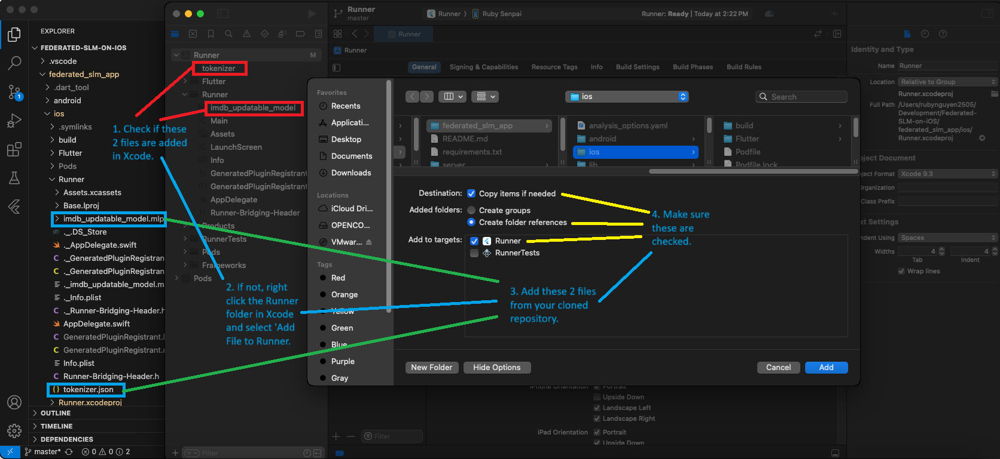

7. Next, click on the top level Runner folder. Select the target Runner, and click on 'Signing and Capabilities' tab as shown. Make sure you check the 'Automatically manage signing'. You also definitely will need an Apple ID to sign so log in and add your Team as shown. Then, change the Bundle Identifier if needed to get a unique identifier for your app. Make sure the Provisioning Profile and Signing Certificate are generated as shown.

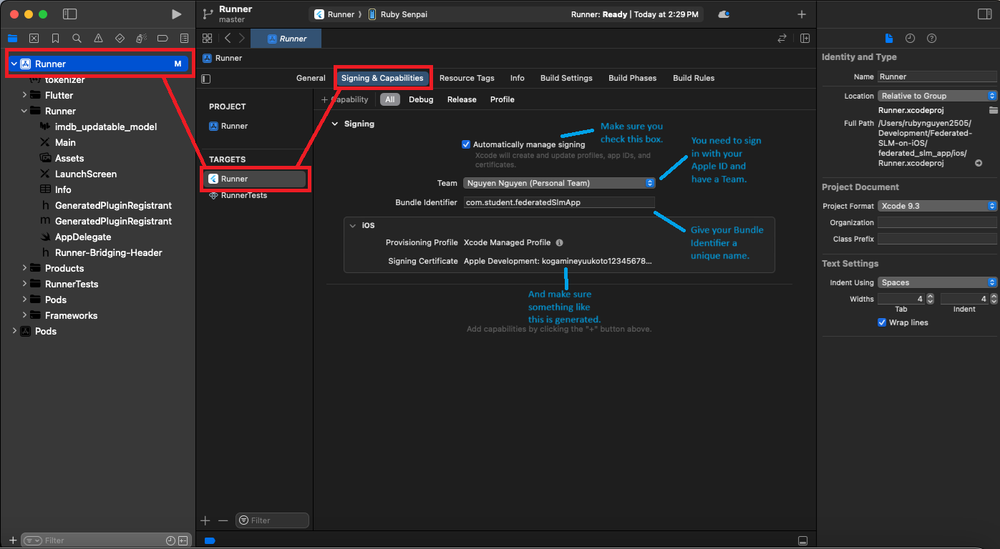

8. Change the tab from 'Signing and Capabilities' to 'Build Settings' and make sure the iOS deployment target is set to 16.0, and CoreML Model Class Generation Language is set to Swift as shown.

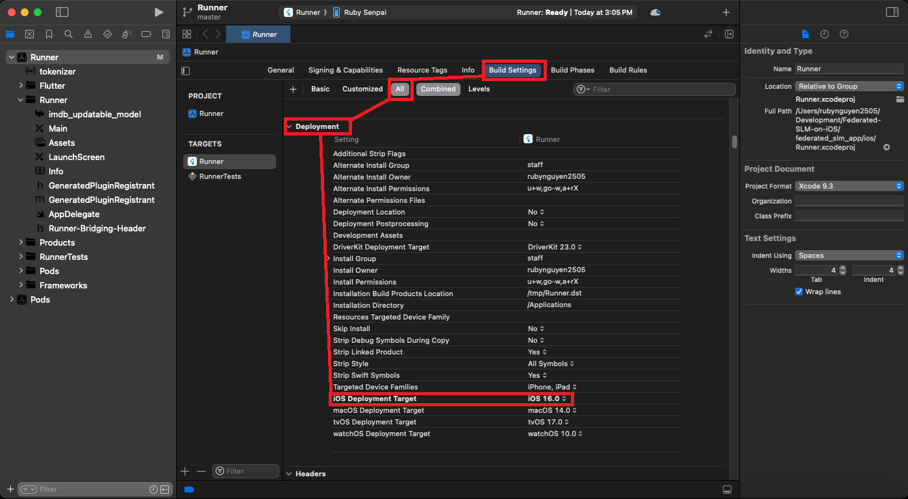

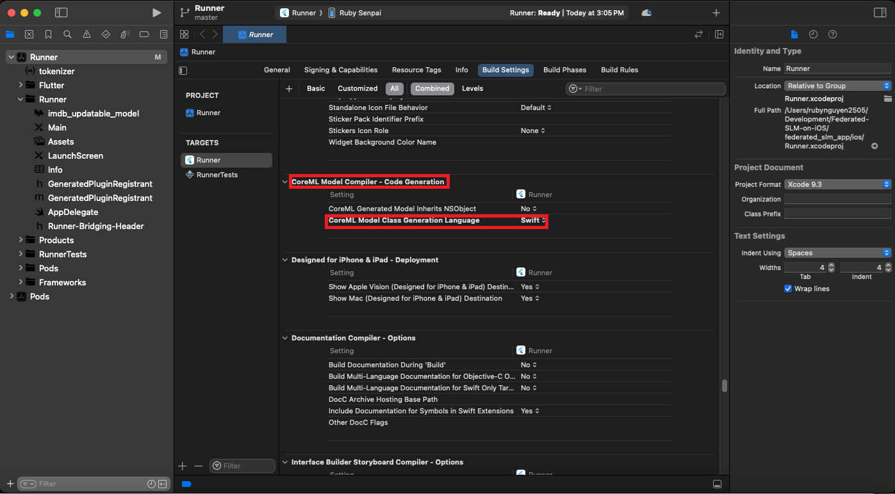

9. Change the tab from 'Build Settings' to 'Build Phases' and make sure `imdb_updatable_model.mlpackage` is included in Compile Sources and `tokenizer.json` is included in Copy Bundle Resources. Once everything checks out in Xcode workspace, you can go ahead and close the Xcode application.

10. Assuming you are back to the `ios/` directory, we next need to configure the HTTP address with which the client is going to communicate with the server. 

   For that, please find the following 2 files and open them with VSCode:
   
   `AppDelegate.swift` that is located in `ios/Runner/`

   `main.dart` that is located in the `lib/` folder. The `lib/` folder is on the same level as the `ios/` folder

   For `AppDelegate.swift`, take note of:
   
   `line 214` in function `uploadModel()` 
   `line 244` in function `callAggregationEndpoint()`
   `line 261` in function `downloadAggregatedModel()`
   `line 315` in function `sendMetricsToServer()`

   For `main.dart`, take note of:

   `line 49` in function `_fetchAndTrainFromServer()`
   `line 81 and 82` in function `_fetchAndpredictFromServer()`

   You will need to change the IP address at those lines to your own IP address.

11. To find your own IP address:

   If you are using macOS virtual machine, then, on **the Windows environment (not WSL)**, run this in **Powershell**:

   ```powershell
   ipconfig
   ```

   If you are using physical macOS machine, run this in a new Terminal:

   ```bash
   ifconfig
   ```
   
12. Look for the **Wireless LAN adapter Wi-Fi** section (if on Windows) or the **en0** section (if on macOS). You’ll see something like:

   ```nginx
   IPv4 Address: 192.168.12.118
   ```

   or 

   ```nginx
   inet 192.168.12.118

   Your IPv4 address should have the form 192.168.x.x

13. Next, if using Windows, **allow Firewall Access on Windows**:

   ```powershell
   New-NetFirewallRule -DisplayName "Allow Flask 5000" -Direction Inbound -Protocol TCP -LocalPort 5000 -Action Allow
   ```

14. Now back to the **Flutter App**, replace the IP address `192.168.12.118:5000` at all the lines we told you to take note earlier with your IPv4 address `192.168.x.x:5000`

14. Now, connect your iPhone to the macOS machine:

   First, you need to connect your iPhone to your machine (whether it is a macOS or Windows machine) using a cable. Then, if you have a macOS virtual machine, do the following:

   Assuming you are using VMWare Workstation Pro to host macOS if you followed the YouTube guides, click on the VM tab on the top bar, select 'Removable Devices' -> 'Apple iPhone' -> 'Connect'. You should see the 'Apple iPhone' checked after your iPhone is successfully connected via VMWare to your macOS virtual machine.

   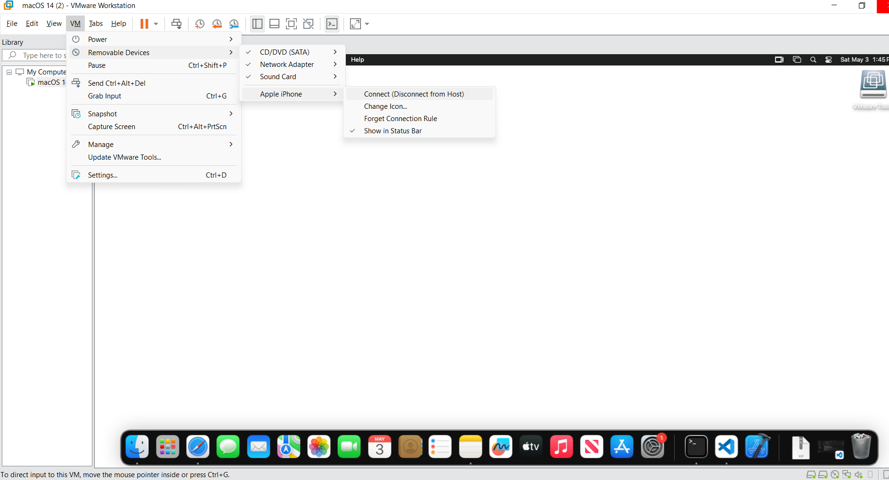

15. Next, run the following command to verify that Flutter recognizes your connected iPhone:

   ```bash
   flutter devices
   ```

   It should list two devices like this, with the top one being your connected iPhone:

   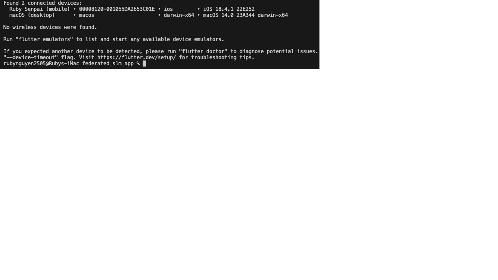

16. Then, run this command:

   ```bash
   flutter run -v
   ```

   This command will build, sign your iOS app and install it on your iPhone.

   Note that, the first time you run this command, you may get stuck at the `Compiling and Signing` phase as shown. A popup with verification of the iOS simruntime may appear and completes its progess once and then gets stuck. Once you see that the popup does not progress anymore or the compiling takes too long, you may `Ctrl + C` to exit and run the `flutter run -v` command again.

   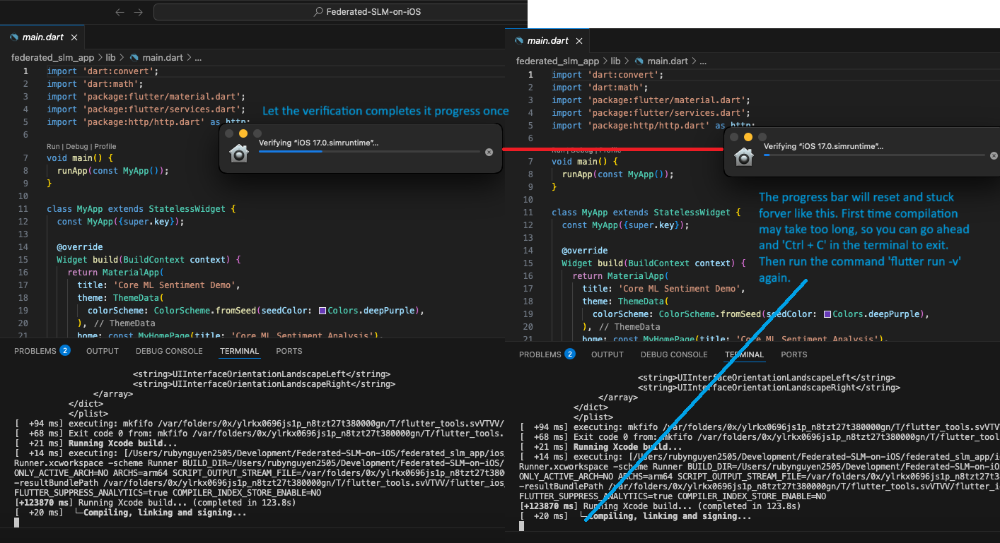

   The process will open up Xcode application again automatically as part of the installation process.

## Running Federated Learning

Once the app is succesfully built and installed on your iPhone, you should see the following debug area in Xcode.

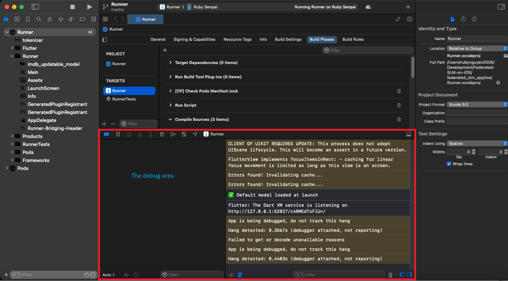

The app on your iPhone should load and show this screen:

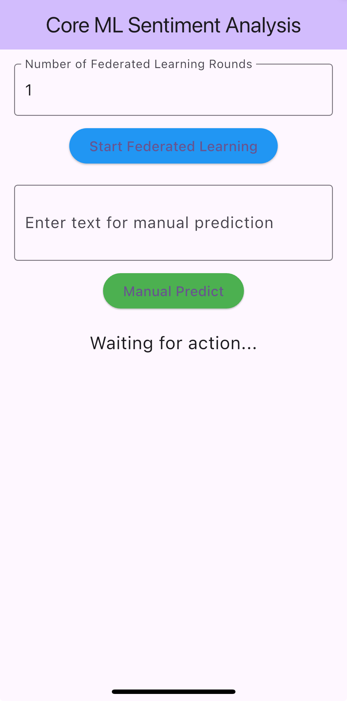

1. First, test that the app is working by running a prediction with your input. Enter a movie review and click `Manual Predict`

   It should show you the confidence level on whether your review tends to be positive or negative.

2. Next, assuming your server is up and running, you can **start the Federated Learning** by inputting the number of rounds you wish to run the federated learning for. Then, click the corresponding button in the app. The app will:

   a. Request a random subset of the training data from the Flask server and does a local model update.
   
   b. Once done training, send the updated model to the Flask server for model aggregation.

   c. Download the aggregated model from the server, compile, and load it for use.
   
   d. Request test data from the Flask server and evaluate the aggregated model on it.

   e. Send the evaluation metrics to the server.

   f. Concludes one round of federated learning and repeat for the user-specified rounds

3. Once the app is done with federated learning, you will find in the `server/` folder the newly generated `federated_metrics_log.csv` and `centralized_model_metrics.csv`. You will also find the `benchmark.py` located there. Open the `benchmark.py` file in VSCode, right click on the file and click `Run Current File in interactive Window`. You will then see the results being visualized.
